# 日志

## logback

### 通用配置

```xml
<?xml version="1.0" encoding="UTF-8"?>
<configuration>
    <property name="log.pattern"
              value="%d{yyyy-MM-dd HH:mm:ss.SSS} %-5level ${PID:- } --- [%15.15t] %-40.40logger{39} : %m%n"
    />
    <property name="CONSOLE_LOG_PATTERN" value="%d{yyyy-MM-dd HH:mm:ss.SSS} %highlight(%-5level) %boldYellow([%thread])  %cyan(%logger{15}) %msg%n"/>

    <appender name="console" class="ch.qos.logback.core.ConsoleAppender">
        <encoder>
            <pattern>${CONSOLE_LOG_PATTERN}</pattern>
            <charset>UTF-8</charset>
        </encoder>
        <!--        <filter class="ch.qos.logback.classic.filter.LevelFilter">-->
        <!--            <level>INFO</level>-->
        <!--            <onMatch>ACCEPT</onMatch>-->
        <!--            <onMismatch>DENY</onMismatch>-->
        <!--        </filter>-->
    </appender>

    <root level="ALL">
        <appender-ref ref="console"/>
    </root>

</configuration>
```


# Transmittable-Thread-Local

[从ThreadLocal谈到TransmittableThreadLocal，从使用到原理2-阿里云开发者社区 (aliyun.com)](https://developer.aliyun.com/article/1394837?spm=a2c6h.12873639.article-detail.9.7f494b91Oogo1q)

## 体系图


## ThreadLocal

ThreadLocal ， 线程本地（变量）

**作用**：保存一些线程隔离的，全局的变量信息。适用于每个线程需要自己独立的实例且该实例需要再多个方法中被使用，即变量在线程间隔离而在方法或类间共享的场景


**使用场景**

1. 保存用户的登录信息
2. 链路追踪
   1. 当前端发送请求到**服务 A**时，**服务 A**会生成一个类似`UUID`的`traceId`字符串，将此字符串放入当前线程的`ThreadLocal`中，在调用**服务 B**的时候，将`traceId`写入到请求的`Header`中，**服务 B**在接收请求时会先判断请求的`Header`中是否有`traceId`，如果存在则写入自己线程的`ThreadLocal`中

总的来说就是**上下文信息的传递以及线程隔离**的使用场景会比较适合。


### 类图结构

Thread中有两个变量分别是`ThreadLocal.ThreadLocalMap threadLocals`和`inheritableThreadLocals`


在这里我们可以知道的是每个线程都会有一个自己的 `ThreadLocalMap`,而`ThreadLocalMap`是ThreadLocal下的一个内部类.


ThreadLocalMap中的内部Entry，就是用来保存键值对的，Entry 继承了 `WeakReference`(弱引用)，为防止内存泄漏而设计的。

```java
public class ThreadLocal<T>{

    static class ThreadLocalMap {
 
        static class Entry extends WeakReference<ThreadLocal<?>> {
            Object value;

            Entry(ThreadLocal<?> k, Object v) {
                super(k);
                value = v;
            }
        }
    }
}
```

### 怎么实现线程隔离

> set方法

```java
public void set(T value) {
    // 1、获取当前线程
    Thread t = Thread.currentThread();
    // 2、获取当前线程的threadlocals成员变量
    ThreadLocalMap map = getMap(t);
    // 3、判断map是否为null
    if (map != null)
        // 如果不为null，就直接将value放进map中
       // key是当前的threadLocal，value就是传进来的值
        map.set(this, value);
    else
        // 如果为 null，初始化一个map，再将value 放进map中
       // key是当前的threadLocal，value就是传进来的值
        createMap(t, value);
}

//返回当前线程的 threadLocals 变量
ThreadLocalMap getMap(Thread t) {
    return t.threadLocals;
}

//进行 ThreadLocalMap 的初始化
void createMap(Thread t, T firstValue) {
    t.threadLocals = new ThreadLocalMap(this, firstValue);
}

//ThreadLocalMap的初始化方法：
ThreadLocalMap(ThreadLocal<?> firstKey, Object firstValue) {
    // 创建一个 Entry 数组
    table = new Entry[INITIAL_CAPACITY];
    // 计算hash值 这里的哈希冲突的解决办法采用了开放地址法，hash冲突的情况则下标挪一位再找
    int i = firstKey.threadLocalHashCode & (INITIAL_CAPACITY - 1);
    // 创建一个 Entry 放进Entry 数组
    table[i] = new Entry(firstKey, firstValue);
    size = 1;
    //计算要调整大小的下一个大小值。
    setThreshold(INITIAL_CAPACITY);
}


```

==小结==：

每个对象最开始的 `threadLocals` 都为空，当线程调用 `ThreadLocal.set() 或 ThreadLocal.get（）`时，就会调用到 `createMap()` 进行初始化。然后在当前线程里面，如果要使用副本变量，就可以通过 get() 在 threadLocals 里面查找。


> get方法

```java
public T get() {
    // 获取到当前线程
    Thread t = Thread.currentThread();
   // 2、获取当前线程的threadlocals成员变量
    ThreadLocalMap map = getMap(t);
    //3、判断map是否为null
    if (map != null) 
        //3.1、如果不为null，根据当前的ThreadLocal 从当前线程中的ThreadLocals中取出map存储的变量副本
        ThreadLocalMap.Entry e = map.getEntry(this);
        // 如果存储的值不为null，就返回值
        if (e != null) {
            @SuppressWarnings("unchecked")
            T result = (T)e.value;
            return result;
        }
    }
    //
    return setInitialValue();
}
```


### 小结

**自始至终，这些本地变量都不是存放在ThreadLocal实例里面，而是存放在调用线程的threadLocals变量，那个线程私有的threadLocalMap 里面**。

ThreadLocal就是一个工具壳和一个key，它通过set方法把value值放入调用线程的threadLocals里面并存放起来，当调用线程调用它的get方法时，再从当前线程的threadLocals变量里面将其拿出来使用。


## InheritableThreadLocal

### 局限性

ThreadLocal设计的目的就是为每条线程都开辟一块自己的局部变量存储区域(并不是为了解决线程安全问题设计的，不过使用ThreadLocal可以避免一定的线程安全问题产生)，但如果你需要将父线程中的数据共享给子线程时，就不怎么方便啦.

```java
public class ThreadLocalExample2 {
​
    private static ThreadLocal<String> threadLocal = new ThreadLocal<>();
    
    public static void main(String[] args) {
        System.out.println("在主线程" + Thread.currentThread().getName() + "中保存临时用户信息");
        String userInfo = "宁在春";
        threadLocal.set(userInfo);
        new Thread(()->{
            // 获取不到父线程存储的信息
            System.out.println("在子线程" + Thread.currentThread().getName() + "中获取临时用户信息 " + threadLocal.get());
        },"MyThread2").start();
        threadLocal.remove();
    }
}
// 在主线程main中保存临时用户信息
// 在子线程pool-1-thread-1中获取临时用户信息 null

```

### 案例

```java
public class InheritableThreadLocalExample {

    private static ThreadLocal<String> threadLocal = new InheritableThreadLocal<>();

    public static void main(String[] args) {
        System.out.println("在主线程" + Thread.currentThread().getName() + "中保存临时用户信息");
        String userInfo = "宁在春";
        threadLocal.set(userInfo);
        new Thread(()->{
            // 获取不到父线程存储的信息
            System.out.println("在子线程" + Thread.currentThread().getName() + "中获取临时用户信息 " + threadLocal.get());
        },"MyThread2").start();
        threadLocal.remove();
    }
}
//输出：
//在主线程main中保存临时用户信息
//在子线程MyThread2中获取临时用户信息 宁在春
```

### 实现原理

Thead中的两个成员变量

```java
ThreadLocal.ThreadLocalMap threadLocals = null;
ThreadLocal.ThreadLocalMap inheritableThreadLocals = null;
```

源码

```java
public class InheritableThreadLocal<T> extends ThreadLocal<T> {

    // 1、获取父线程的数据
    protected T childValue(T parentValue) {
        return parentValue;
    }
    // 2、 获取 inheritableThreadLocals 变量
    ThreadLocalMap getMap(Thread t) {
       return t.inheritableThreadLocals;
    }

    // 3、为当前线程进行 inheritableThreadLocals 的初始化
    void createMap(Thread t, T firstValue) {
        t.inheritableThreadLocals = new ThreadLocalMap(this, firstValue);
    }
}

```

在这个方法里面，只有`T childValue()`是我们在 ThreadLocal 中没有接触过的方法，那么肯定是有点妙用的。其他的就是从`threadLocals`改成了`inheritableThreadLocals`，没有太多改变。

真正的起点是在`new Thread(() - >{})`

```java
public Thread(Runnable target) {
    init(null, target, "Thread-" + nextThreadNum(), 0);
}

public Thread(Runnable target, String name) {
    init(null, target, name, 0);
}

private void init(ThreadGroup g, Runnable target, String name, long stackSize) {
    init(g, target, name, stackSize, null, true);
}

private void init(ThreadGroup g,
                  Runnable target, String name,
                  long stackSize, AccessControlContext acc,boolean inheritThreadLocals) {
    
    if (name == null) {
        throw new NullPointerException("name cannot be null");
    }

    this.name = name;
    // 获取当前执行线程作为父线程
    Thread parent = currentThread();
    SecurityManager security = System.getSecurityManager();
    // 省略一些检查相关的代码...

    // 将当前执行线程设置为创建出的线程的父线程
    this.group = g;
    
    // 省略了一些不是关注点的代码...
    
    // 我们需要关注的点
    // 判断 父线程的inheritThreadLocals 和 当前线程的 inheritThreadLocals 是否为 null
    if (inheritThreadLocals && parent.inheritableThreadLocals != null){
        // 不为null,才进行初始化，设置子线程中的inheritableThreadLocals变量
        this.inheritableThreadLocals =
        ThreadLocal.createInheritedMap(parent.inheritableThreadLocals);
    }
    // 为创建出的线程分配默认线程栈大小
    this.stackSize = stackSize;

    // 设置线程ID
    tid = nextThreadID();
}


//小结：将父线程的inheritableThreadLocals赋值给子线程

```

```java
static ThreadLocalMap createInheritedMap(ThreadLocalMap parentMap) {
    return new ThreadLocalMap(parentMap);
}

//  ThreadLocalMap类 私有构造函数
private ThreadLocalMap(ThreadLocalMap parentMap) {
    // 获取父线程中的存储的所有变量
    Entry[] parentTable = parentMap.table;
    int len = parentTable.length;
    setThreshold(len);
    table = new Entry[len];

    // 循环复制父线程中的Entry
    for (int j = 0; j < len; j++) {
        Entry e = parentTable[j];
        if (e != null) {
            @SuppressWarnings("unchecked")
            ThreadLocal<Object> key = (ThreadLocal<Object>) e.get();
            if (key != null) {
                //调用了 InheritableThreadLocal 重写的 childValue 方法
                // 获取到 e.value 值
                Object value = key.childValue(e.value);
                Entry c = new Entry(key, value);
                int h = key.threadLocalHashCode & (len - 1);
                while (table[h] != null)
                    h = nextIndex(h, len);
                table[h] = c;
                size++;
            }
        }
    }
}

```

### 在线程池中的局限性


**在线程池中，线程是复用的，并不用每次新建，那么此时`InheritableThreadLocal`复制的父线程就变成了第一个执行任务的线程了，即后面所有新建的线程，他们所访问的本地变量都源于第一个执行任务的线程（期间也可能会遭遇到其他线程的修改），从而造成本地变量混乱**。

> 案例

比如：

假如我们有这样的一个流程，10个请求到达controller，然后调用service，在service中我们还要执行一个异步任务，最后等待结果的返回。

10个service - > 10个异步任务 ，在service，我们会设置一个变量副本，在执行异步任务的子线程中，需要get出来进行调用。

```java
import lombok.extern.slf4j.Slf4j;

import java.util.concurrent.CompletableFuture;
import java.util.concurrent.ExecutorService;
import java.util.concurrent.Executors;

public class InheritableThreadLocalDemo3 {


    private static ExecutorService businessExecutors = Executors.newFixedThreadPool(5);

 
    private static InheritableThreadLocal<Integer> requestIdThreadLocal = new InheritableThreadLocal<>();

    public static void main(String[] args) {
        // 模式10个请求，每个请求执行ControlThread的逻辑，其具体实现就是，先输出父线程的名称，
        for (int i = 0; i < 10; i++) {
          // 然后设置本地环境变量，并将父线程名称传入到子线程中，在子线程中尝试获取在父线程中的设置的环境变量
            new Thread(new ServiceThread(i)).start();
        }
       
        Thread.sleep(10000);
      
        //关闭线程池
        businessExecutors.shutdown();
    }

    /**
     * 模拟Service业务代码
     */
    @Slf4j
    static class ServiceThread implements Runnable {
        private int i;

        public ServiceThread(int i) {
            this.i = i;
        }

        @Override
        public void run() {
            requestIdThreadLocal.set(i);
            
            log.info("执行service方法==>在{}中存储变量副本==>{}", Thread.currentThread().getName(), i);
            
            // 异步编程 CompletableFuture.runAsync()创建无返回值的简单异步任务，businessExecutors 表示线程池~
            CompletableFuture<Void> runAsync = CompletableFuture.runAsync(() -> {
                // 模拟执行时间
                Thread.sleep(500L);
              
                log.info("执行异步任务，在执行异步任务的线程中，获取父线程（service）中存储的值：{}", requestIdThreadLocal.get());
            }, businessExecutors);

            requestIdThreadLocal.remove();
        }
        
        
    }
}
```

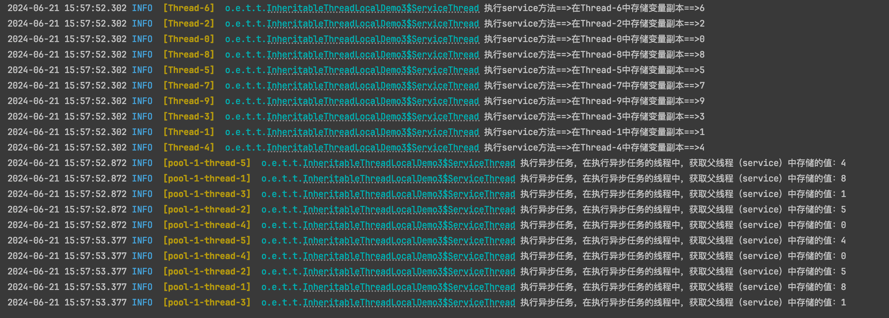

## TransmittableThreadLocal

### 介绍

`TransmittableThreadLocal` 是alibaba 开源的一个工具类，[github地址](https://link.juejin.cn?spm=a2c6h.13046898.publish-article.12.62db6ffahjb26k&target=https%3A%2F%2Fgithub.com%2Falibaba%2Ftransmittable-thread-local)

是用于解决 **“在使用线程池等会缓存线程的组件情况下传递ThreadLocal”** 问题的 InheritableThreadLocal 扩展工具类。

回到上面的问题，我们使用 `TransmittableThreadLocal` 来改造一下上面的问题吧

添加相关依赖：

```xml
<!--https://github.com/alibaba/transmittable-thread-local/releases/tag/v2.14.2-->
<dependency>
    <groupId>com.alibaba</groupId>
    <artifactId>transmittable-thread-local</artifactId>
    <version>2.14.2</version>
</dependency>
```

### 使用方式

创建线程池时用到了**装饰器模式**

```java
@Slf4j
public class TransmittableThreadLocalDemo1 {

    /**
     * 业务线程池，service 中执行异步任务的线程池
     * 使用 TtlExecutors.getTtlExecutorService() 包装一下我们自己的线程池，这样才可以 使用 TransmittableThreadLocal 解决在使用线程池等会缓存线程的组件情况下传递ThreadLocal的问题
     */
    private static ExecutorService businessExecutors = TtlExecutors.getTtlExecutorService(Executors.newFixedThreadPool(5));

    
    private static TransmittableThreadLocal<Integer> requestIdThreadLocal = new TransmittableThreadLocal<>();

    @SneakyThrows
    public static void main(String[] args) {
        // 模式10个请求，每个请求执行ControlThread的逻辑，其具体实现就是，先输出父线程的名称，
        for (int i = 0; i < 10; i++) {
        // 然后设置本地环境变量，并将父线程名称传入到子线程中，在子线程中尝试获取在父线程中的设置的环境变量
            new Thread(new ServiceThread(i)).start();
        }
        Thread.sleep(10000);
        //关闭线程池
        businessExecutors.shutdown();
    }

    /**
     * 模拟Service业务代码
     */
    static class ServiceThread implements Runnable {
        private int i;

        public ServiceThread(int i) {
            this.i = i;
        }

        @Override
        public void run() {
            requestIdThreadLocal.set(i);

            log.info("执行service方法==>在{}中存储变量副本==>{}", Thread.currentThread().getName(), i);

            CompletableFuture.runAsync(() -> {
                // 模拟执行时间
                try {
                    Thread.sleep(500L);
                } catch (InterruptedException e) {
                    throw new RuntimeException(e);
                }

                log.info("执行异步任务，在执行异步任务的线程中，获取父线程（service）中存储的值：{}", requestIdThreadLocal.get());
            }, businessExecutors);

            requestIdThreadLocal.remove();
        }
    }
}

```

结果get()没有出现错乱


### 源码分析

> 线程池的包装

在第一个案例中，使用 TransmittableThreadLocal 时，我们也使用了 `TtlExecutors.getTtlExecutorService()`对我们的线程池做了增强（这也是必须的搭配，否则没法使用 TransmittableThreadLocal 特性）

```java
 private static ExecutorService businessExecutors = TtlExecutors.getTtlExecutorService(Executors.newFixedThreadPool(5));
```

```java
public static ExecutorService getTtlExecutorService(ExecutorService executorService) {
    if (TtlAgent.isTtlAgentLoaded() || 
        executorService == null || 
        executorService instanceof TtlEnhanced) {
        return executorService;
    }
    return new ExecutorServiceTtlWrapper(executorService, true);
}

```

```java
class ExecutorServiceTtlWrapper extends ExecutorTtlWrapper implements ExecutorService, TtlEnhanced {
       
    private final ExecutorService executorService;

    ExecutorServiceTtlWrapper(ExecutorService executorService, boolean idempotent) {
        super(executorService, idempotent);
        this.executorService = executorService;
    }
    
    //.....
}

```

这就是一个构造函数，那么最后我们使用的线程池也就是这个增强后的`ExecutorServiceTtlWrapper`了。它在这里也实现了`ExecutorService`接口，那么肯定是实现了里面的所有方法。

我们直接跳到`submit`方法，看看它做了什么操作，让它得以增强吧。

```java
@NonNull
@Override
public <T> Future<T> submit(@NonNull Callable<T> task) {
    return executorService.submit(TtlCallable.get(task, false, idempotent));
}

@NonNull
@Override
public <T> Future<T> submit(@NonNull Runnable task, T result) {
    return executorService.submit(TtlRunnable.get(task, false, idempotent), result);
}

@NonNull
@Override
public Future<?> submit(@NonNull Runnable task) {
    return executorService.submit(TtlRunnable.get(task, false, idempotent));
}
```

在这里能看到`transmittable-thread-local`是对我们用到的`Runnable、Callable`都进行包装增强。

> 线程任务的包装

TtlRunnable 代码

​    
```java
public final class TtlRunnable implements Runnable, TtlWrapper<Runnable>, TtlEnhanced, TtlAttachments {
    private final AtomicReference<Object> capturedRef;

	private final Runnable runnable;
    
    // 运行后是否 释放 Ttl 值的引用
	private final boolean releaseTtlValueReferenceAfterRun;

	private TtlRunnable(@NonNull Runnable runnable, boolean releaseTtlValueReferenceAfterRun) {
    	// capture() 这里具体调用的是 TransmittableThreadLocal下内部类Transmitter的capture()方法
    	// 捕获当前线程中的所有TransmittableThreadLocal和注册的ThreadLocal值。
    	// 之后会详细看到滴
    	this.capturedRef = new AtomicReference<>(capture());
    	this.runnable = runnable;
    	this.releaseTtlValueReferenceAfterRun = releaseTtlValueReferenceAfterRun;
	}

	@Override
    public void run() {
        //获取所有的ttl及tl快照内容 即获取到主线程传递下来的ThreadLocal的值。
    	final Object captured = capturedRef.get();
    	if (captured == null || releaseTtlValueReferenceAfterRun &&
            !capturedRef.compareAndSet(captured, null)) {
            throw new IllegalStateException("TTL value reference is released after run!");
        }
    	//重放从capture()捕获的TransmittableThreadLocal和注册的ThreadLocal值，并在重放之前返回当前线程中的备份TransmittableThreadLocal值。
        /**
        * 1.  backup（备份）是子线程已经存在的ThreadLocal变量；
        * 2. 将captured的ThreadLocal值在子线程中set进去；
        */
        final Object backup = replay(captured); 
        try {
            //执行线程的任务
        	runnable.run();
    	} finally {
        	//从replay(Object) / clear()恢复备份的TransmittableThreadLocal和注册的ThreadLocal值。
       		// 恢复线程执行replay方法之前的TTL值
        	restore(backup);
    	}
	}
} 
```


### 不正确使用bug

线程池线程数=1

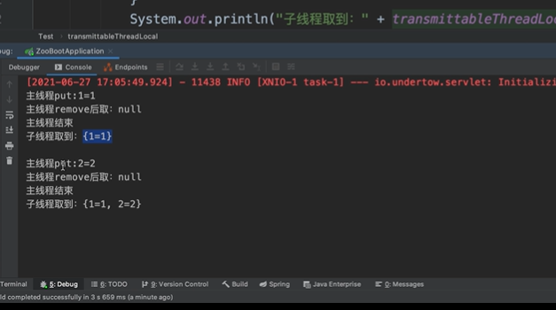

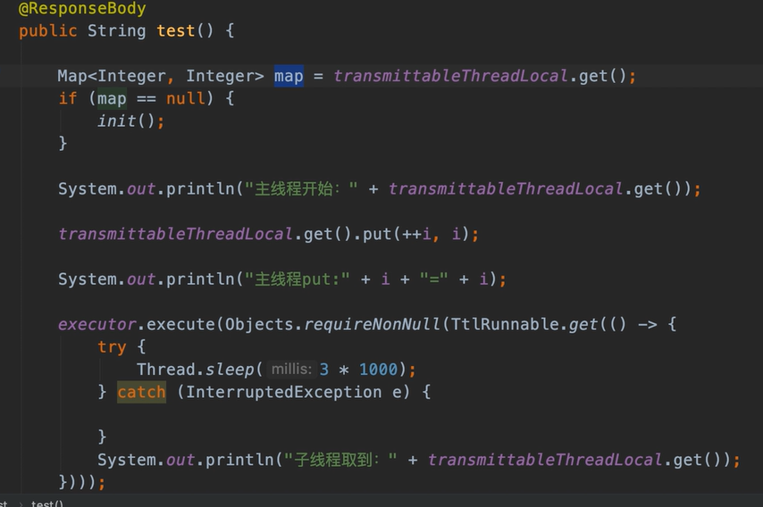

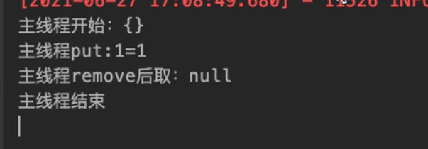

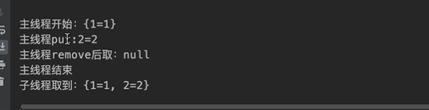

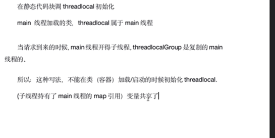

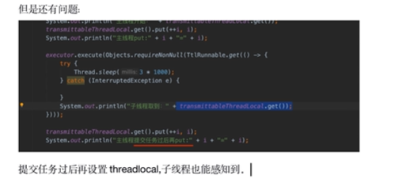


# 鉴权


# CompletableFuture


# MapStructUtil

类似于BeanCpoy

不同的是可以灵活指定source filed 和 target filed

## 入门案例

```xml
<dependency>
    <groupId>org.mapstruct</groupId>
    <artifactId>mapstruct</artifactId>
    <version>1.5.5.Final</version>
</dependency>
<dependency>
    <groupId>org.mapstruct</groupId>
    <artifactId>mapstruct-processor</artifactId>
    <version>1.5.5.Final</version>
    <scope>provided</scope>
</dependency>
```

```java
import org.mapstruct.Mapper;
import org.mapstruct.Mapping;
import org.mapstruct.factory.Mappers;

@Mapper
public interface MapStructUtil {

    MapStructUtil INSTANCE = Mappers.getMapper(MapStructUtil.class);

    @Mapping(source = "username", target = "xm")
    UserVo copy(User user);
}

```

## 原理

在编译的时候自动生成==实现类==

## 其他


> 多参数源映射


> 多层嵌套映射


> 更新现有Bean

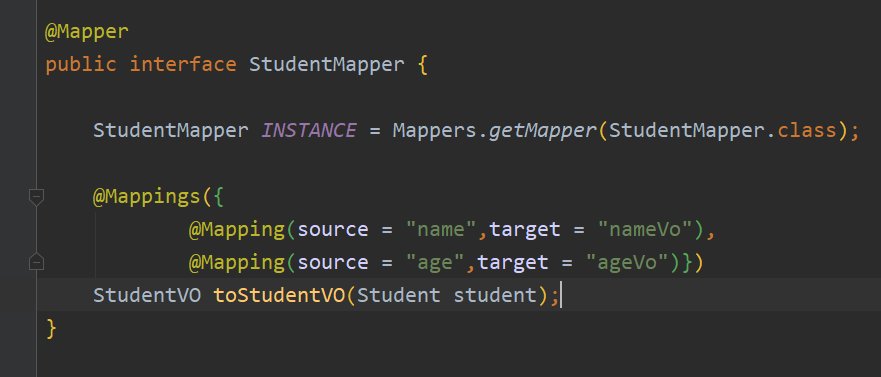

> 依赖注入

  某些时候尤其是在做项目时，我们用到了Sping，希望映射后的新实例是交给Spring管理。这时候就需要进行依赖注入了。只需要在Mapper接口中的@Mapper注解中加入componentModel = "spring"即可。


> 类型转换

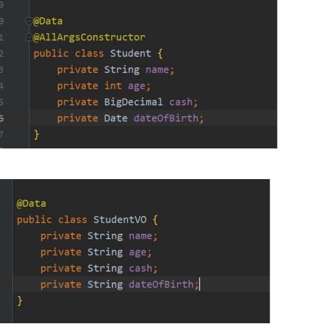


# Websocket

## 什么是消息推送

移动端消息推送示例：


Web 端消息推送示例：


在具体实现之前，咱们再来分析一下前边的需求，其实功能很简单，只要触发某个事件（主动分享了资源或者后台主动推送消息），Web 页面的通知小红点就会实时的 `+1` 就可以了。

通常在服务端会有若干张消息推送表，用来记录用户触发不同事件所推送不同类型的消息，前端主动查询（拉）或者被动接收（推）用户所有未读的消息数。

消息推送表

消息推送无非是推（push）和拉（pull）两种形式，下边我们逐个了解下。

## 消息推送常见方案

### 短轮询

短轮询很好理解，指定的时间间隔，由浏览器向服务器发出 HTTP 请求，服务器实时返回未读消息数据给客户端，浏览器再做渲染显示。

一个简单的 JS 定时器就可以搞定，每秒钟请求一次未读消息数接口，返回的数据展示即可。

```typescript
setInterval(() => {
  // 方法请求
  messageCount().then((res) => {
    if (res.code === 200) {
      this.messageCount = res.data;
    }
  });
}, 1000);
```

### 长轮询

```java
import com.google.common.collect.HashMultimap;
import com.google.common.collect.Multimap;
import com.google.common.collect.Multimaps;
import org.springframework.web.bind.annotation.GetMapping;
import org.springframework.web.bind.annotation.PathVariable;
import org.springframework.web.bind.annotation.RestController;
import org.springframework.web.context.request.async.DeferredResult;

import java.util.Collection;
import java.util.Date;

@RestController
public class PollingController {

    // 存放监听某个Id的长轮询集合
    // 线程同步结构
    public static Multimap<String, DeferredResult<String>> watchRequests =
            Multimaps.synchronizedMultimap(HashMultimap.create());

    /**
     * 设置监听
     */
    @GetMapping(path = "/watch/{id}")
    public DeferredResult<String> watch(@PathVariable String id) {
        // 延迟对象设置超时时间
        DeferredResult<String> result = new DeferredResult<>(3 * 1000L);
        // 异步请求完成时移除 key，防止内存溢出
        result.onCompletion(() -> {
            watchRequests.remove(id, result);
        });
        // 注册长轮询请求
        watchRequests.put(id, result);
        return result;
    }

    /**
     * 变更数据
     */
    @GetMapping(path = "/publish/{id}")
    public String publish(@PathVariable String id) {
        // 数据变更 取出监听ID的所有长轮询请求，并一一响应处理
        if (watchRequests.containsKey(id)) {
            Collection<DeferredResult<String>> deferredResults = watchRequests.get(id);
            for (DeferredResult<String> deferredResult : deferredResults) {
                deferredResult.setResult("我更新了" + new Date());
            }
        }
        return "success";
    }
}
```


### SSE

SSE 在服务器和客户端之间打开一个单向通道，服务端响应的不再是一次性的数据包而是`text/event-stream`类型的数据流信息，在有数据变更时从服务器流式传输到客户端。

整体的实现思路有点类似于在线视频播放，视频流会连续不断的推送到浏览器，你也可以理解成，客户端在完成一次用时很长（网络不畅）的下载。

> SSE 与 WebSocket

1. 1. ==SSE== 是基于 HTTP 协议的，它们不需要特殊的协议或服务器实现即可工作；
   2. ==WebSocket== 需单独服务器来处理协议。

2. 1. ==SSE== 单向通信，只能由服务端向客户端单向通信；
   2. ==WebSocket== 全双工通信，即通信的双方可以同时发送和接受信息。

SSE 实现简单开发成本低，无需引入其他组件；WebSocket 传输数据需做二次解析，开发门槛高一些。

SSE 默认支持断线重连；WebSocket 则需要自己实现。

SSE 只能传送文本消息，二进制数据需要经过编码后传送；WebSocket 默认支持传送二进制数据。


# 分布式限流 - Redisson

## 环境搭建

```xml
<dependency>
    <groupId>org.springframework.boot</groupId>
    <artifactId>spring-boot-starter-web</artifactId>
</dependency>
<dependency>
    <groupId>org.redisson</groupId>
    <artifactId>redisson-spring-boot-starter</artifactId>
    <version>3.18.0</version>
</dependency>
<!-- 引入aop支持 -->
<dependency>
    <groupId>org.springframework.boot</groupId>
    <artifactId>spring-boot-starter-aop</artifactId>
</dependency>
```

代码部分看项目

## 流程

1. AOP 获取限流注解，没有就是释放

2. 表达式非空且入参不满足表达式，则不进行限流

3. 组装key

   1. IP
   2. PATH
   3. 入参
   4. user_agent
   5. header

4. CacheRateLimiterUtils.tryAcquire 尝试获取令牌

   1. acquire

      1. true，执行point.proceed()

         1. 如果报错，抛异常

            ```js
            // hasThrowable = true
            CacheRateLimiterUtil.cancel(key)
            ```

      2. false，return Error

   2. hasThrowable，表示获取令牌时报错


```java
public static boolean tryAcquire(String key,long period,long permit,long timeout){
    
}
```


## 原理

[谈谈限流算法，以及Redisson实现 - 个人文章 - SegmentFault 思否](https://segmentfault.com/a/1190000043472098#item-3-7)

### 实例

```java
@RestController
@RequestMapping("")
@Slf4j
public class DemoController {
    private final RedissonClient redissonClient;

    public DemoController(RedissonClient redissonClient) {
        this.redissonClient = redissonClient;
    }


    @GetMapping("require")
    public void hello(Integer num) {
        RRateLimiter rateLimiter = redissonClient.getRateLimiter("LIMITER_NAME");
        rateLimiter.trySetRate(RateType.OVERALL, 5, 10, RateIntervalUnit.SECONDS);
        rateLimiter.tryAcquire(num,1,TimeUnit.MINUTES);
        
        log.info("get!");
    }
}
```

### 数据结构

限流算法中，一共用到的 3个 redis key

> key 1：Hash 结构

就是前面 `setRate` 设置的 hash key。按照之前限流器命名“LIMITER_NAME”，这个 redis key 的名字就是 `LIMITER_NAME`。一共有3个值：

1. `rate`：代表速率
2. `interval`：代表多少时间内产生的令牌
3. `type`：代表单机还是集群

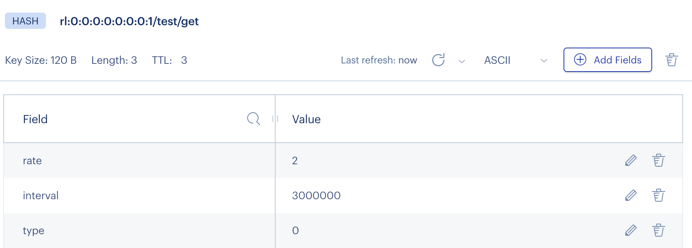


> key 2：ZSET 结构

ZSET 记录获取令牌的时间戳，用于时间对比，redis key 的名字是 `{LIMITER_NAME}:permits`。下面讲讲 ZSET 中每个元素的 member 和 score：

1. member`： 包含两个内容：(1)一段8位随机字符串，为了唯一标志性当次获取令牌；（2）数字，即当次获取令牌的数量。不过这些是压缩后存储在 redis 中的，在工具上看时会发现乱码。`
1. `score`：记录获取令牌的时间戳，如：1667025166312（对应 2022-10-29 14:32:46）

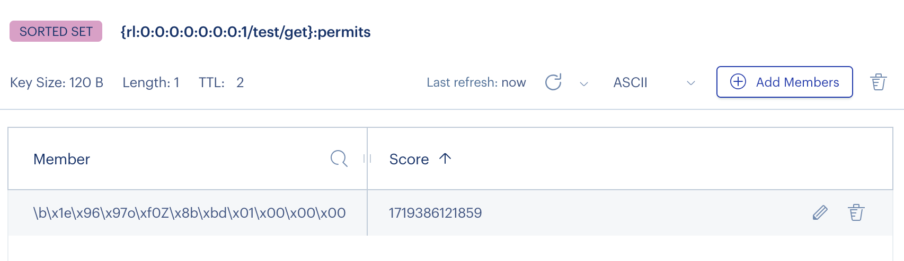

> 3. key 3： string 结构

记录的是当前令牌桶中剩余的令牌数。redis key 的名字是 `{LIMITER_NAME}:value`。

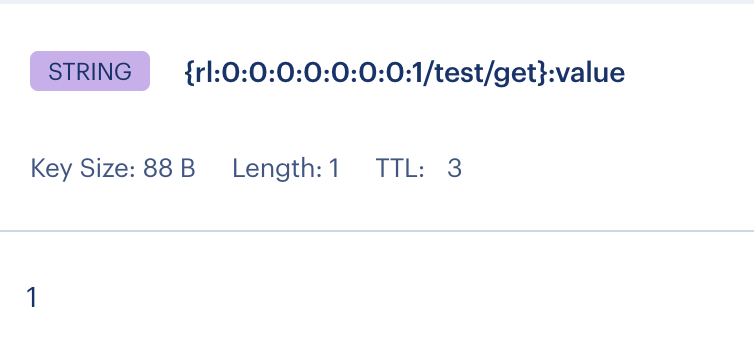

### 主要方法

> trySetRate 尝试设置

```java
@Override
public RFuture<Boolean> trySetRateAsync(RateType type, long rate, long rateInterval, RateIntervalUnit unit) {
    return commandExecutor.evalWriteNoRetryAsync(getRawName(), LongCodec.INSTANCE, RedisCommands.EVAL_BOOLEAN,
                "redis.call('hsetnx', KEYS[1], 'rate', ARGV[1]);"
              + "redis.call('hsetnx', KEYS[1], 'interval', ARGV[2]);"
              + "return redis.call('hsetnx', KEYS[1], 'type', ARGV[3]);",
;
```

核心是其中的 lua 脚本，摘出来看看：

```lua
redis.call('hsetnx', KEYS[1], 'rate', ARGV[1]);
redis.call('hsetnx', KEYS[1], 'interval', ARGV[2]);
return redis.call('hsetnx', KEYS[1], 'type', ARGV[3]);
```

发现基于一个 hash 类型的redis key 设置了3个值。

不过这里的命令是 `hsetnx`，redis `hsetnx` 命令用于为哈希表中不存在的的字段赋值。

- 如果哈希表不存在，一个新的哈希表被创建并进行 `hset` 操作。
- 如果字段已经存在于哈希表中，操作无效。
- 如果 key 不存在，一个新哈希表被创建并执行 `hsetnx` 命令。

这意味着，这个方法只能做配置的初始化，如果后期想要修改配置参数，该方法并不会生效。我们来看看另外一个方法。


> setRate 重新设置

重新设置是，不管该key之前有没有用，一切都清空回到初始化，重新设置。

```lua
redis.call('hset', KEYS[1], 'rate', ARGV[1]);
redis.call('hset', KEYS[1], 'interval', ARGV[2]);
redis.call('hset', KEYS[1], 'type', ARGV[3]);
redis.call('del', KEYS[2], KEYS[3]);
```

上述的参数如下：

- `KEYS[1]`：hash key name
- `KEYS[2]`：string(value) key name
- `KEYS[3]`：zset(permits) key name
- `ARGV[1]`：rate
- `ARGV[2]`：interval
- `ARGV[3]`：type

通过这个 lua 的逻辑，就能看出直接用的是 `hset`，会直接重置配置参数，并且同时会将已产生数据的string(value)、zset(permits) 两个key 删掉。是一个彻底的重置方法。

这里回顾一下 `trySetRate` 和 `setRate`，在限流器不变的场景下，我们可以多次调用 `trySetRate`，但是不能调用 `setRate`。因为每调用一次，`redis.call('del', KEYS[2], KEYS[3])` 就会将限流器中数据清空，也就达不到限流功能。


> 设置过期时间 expire

有没有发现前面针对限流器设置的3个 key，都没有设置过期时间。RRateLimiter 接口在设计上，将设置过期时间单独拧出来了。

```java
// 设置过期
boolean expire(long var1, TimeUnit var3);
// 清除过期（永不过期）
boolean clearExpire();
```

值得注意的是，**这个方法是针对3个key一起设置统一的过期时间**


> 获取令牌（核心）tryAcquire

我们先看看执行 lua 脚本时，所有要传入的参数内容：

- `KEYS[1]`：hash key name
- `KEYS[2]`：全局 string(value) key name
- `KEYS[3]`：单机 string(value) key name
- `KEYS[4]`：全局 zset(permits) key name
- `KEYS[5]`：单机 zset(permits) key name
- `ARGV[1]`：当前请求令牌数量
- `ARGV[2]`：当前时间
- `ARGV[3]`：8位随机字符串

```lua
-- rate：间隔时间内产生令牌数量
-- interval：间隔时间
-- type：类型：0-全局限流；1-单机限
local rate = redis.call('hget', KEYS[1], 'rate');
local interval = redis.call('hget', KEYS[1], 'interval');
local type = redis.call('hget', KEYS[1], 'type');
-- 如果3个参数存在空值，错误提示初始化未完成
assert(rate ~= false and interval ~= false and type ~= false, 'RateLimiter is not initialized')
local valueName = KEYS[2];
local permitsName = KEYS[4];
-- 如果是单机限流，在全局key后拼接上机器唯一标识字符
if type == '1' then
    valueName = KEYS[3];
    permitsName = KEYS[5];
end ;
-- 如果：当前请求令牌数 < 窗口时间内令牌产生数量，错误提示请求令牌不能超过rate
assert(tonumber(rate) >= tonumber(ARGV[1]), 'Requested permits amount could not exceed defined rate');
-- currentValue = 当前剩余令牌数量
local currentValue = redis.call('get', valueName);
-- 非第一次访问，存储剩余令牌数量的 string(value) key 存在，有值（包括 0）
if currentValue ~= false then
    -- 当前时间戳往前推一个间隔时间，属于时间窗口以外。时间窗口以外，签发过的令牌，都属于过期令牌，需要回收回来
    local expiredValues = redis.call('zrangebyscore', permitsName, 0, tonumber(ARGV[2]) - interval);
    -- 统计可以回收的令牌数量
    local released = 0;
    for i, v in ipairs(expiredValues) do
        -- lua struct的pack/unpack方法，可以理解为文本压缩/解压缩方法
        local random, permits = struct.unpack('fI', v);
        released = released + permits;
    end ;
    -- 移除 zset(permits) 中过期的令牌签发记录
    -- 将过期令牌回收回来，重新更新剩余令牌数量
    if released > 0 then
        redis.call('zremrangebyscore', permitsName, 0, tonumber(ARGV[2]) - interval);
        currentValue = tonumber(currentValue) + released;
        redis.call('set', valueName, currentValue);
    end ;
    -- 如果 剩余令牌数量 < 当前请求令牌数量，返回推测可以获得所需令牌数量的时间
    -- （1）最近一次签发令牌的释放时间 = 最近一次签发令牌的签发时间戳 + 间隔时间(interval)
    -- （2）推测可获得所需令牌数量的时间 = 最近一次签发令牌的释放时间 - 当前时间戳
    -- （3）"推测"可获得所需令牌数量的时间，"推测"，是因为不确定最近一次签发令牌数量释放后，加上到时候的剩余令牌数量，是否满足所需令牌数量
    if tonumber(currentValue) < tonumber(ARGV[1]) then
        local nearest = redis.call('zrangebyscore', permitsName, '(' .. (tonumber(ARGV[2]) - interval), '+inf', 'withscores', 'limit', 0, 1);
        return tonumber(nearest[2]) - (tonumber(ARGV[2]) - interval);
        -- 如果 剩余令牌数量 >= 当前请求令牌数量，可直接记录签发令牌，并从剩余令牌数量中减去当前签发令牌数量
    else
        redis.call('zadd', permitsName, ARGV[2], struct.pack('fI', ARGV[3], ARGV[1]));
        redis.call('decrby', valueName, ARGV[1]);
        return nil;
    end ;
    -- 第一次访问，存储剩余令牌数量的 string(value) key 不存在，为 null，走初始化逻辑
else
    redis.call('set', valueName, rate);
    redis.call('zadd', permitsName, ARGV[2], struct.pack('fI', ARGV[3], ARGV[1]));
    redis.call('decrby', valueName, ARGV[1]);
    return nil;
end ;
```

简述过程

1. 获取`rate:间隔时间内产生的令牌数量` ，`interva:间隔时间`，`type:类型 0-全局限流 1-单机限流`
   - 如果三个参数存在空值，则退出
   - 如果**当前请求令牌数**>=**rate**，退出
2. 第一次访问
   - 初始化map，set（当前时间，random+请求令牌数量），string
3. 非第一次访问
   - 当前时间戳往前推一个间隔时间，属于时间窗口以外。时间窗口以外，签发过的令牌，都属于过期令牌，需要回收回来
   - 回收后，**剩余令牌数量 < 当前请求令牌数量**
   - 如果 **剩余令牌数量 >= 当前请求令牌数量**，可直接记录签发令牌，并从剩余令牌数量中减去当前签发令牌数量


# StringJoiner

## 介绍

StringJoiner是java.util包下的一个工具类，jdk1.8出来的

作用是在构造字符串时，可以自动添加前缀、后缀及分隔符，而不需要自己去实现这些添加字符的逻辑

## demo

```java
StringJoiner sj1 = new StringJoiner(",");	
StringJoiner sj2 = new StringJoiner(",", "[", "]");

// a,b,c
System.out.println(sj1.add("a").add("b").add("c"));

//[a,b,c]
System.out.println(sj2.add("a").add("b").add("c"));

//a,b,c,a,b,c
System.out.println(sj1.merge(sj2));

//[a,b,c,a,b,c,a,b,c]
System.out.println(sj2.merge(sj1));

//11 = 9 + 前后缀
System.out.println(sj1.length());

```


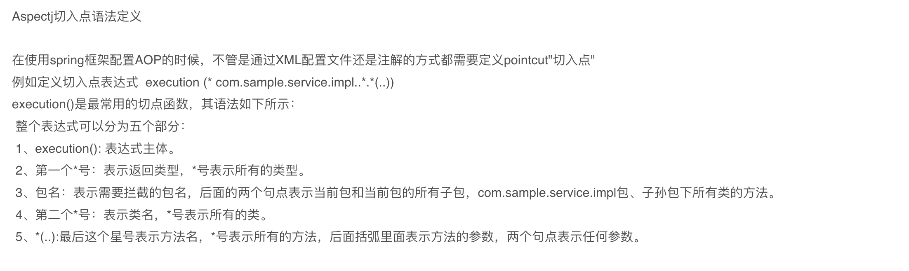


